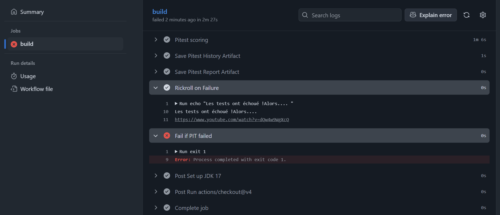

# Rapport pour la tâche 3

## 1. Github Action qui n'accepte pas une baisse du score PiTest

### Choix de conception et solution implémentée

**Fonctionnement de l'action :**

Principalement, cette action est gérée par un script python qui prend l'ancien rapport pitest, calcul le score pitest à partir ce rapport, lance pitest, fait le calcul à nouveau, et enfin, compare les deux scores. Si le score baisse, il retourne 1 pour provoquer une erreur dans l'action Github. Sinon, il retourne 0.

**Problème identifié avec l'historique :**

Mais pendant les tests de ce script, on a remarqué que, des fois, quand on enlève un test, le score pitest a élevé, puis en faisant rien que de lancer pitest encore une fois, le score revient au niveau précédent. Donc, si le score est à 53 %, puis on enlève un test et relance pitest, le score s'élève à 55 %. Si pitest est relancé encore une fois, sans aucun changement dans le code, le score revient à 53 %. On croit que ce changement est causé par l'utilisation d'historique. Évidemment, l'historique ne traite que les classes. Donc, si on modifie un test, l'historique va empêcher la reprise des tests modifiés, et, par la suite, le recalcul du score pitest. 

**Solution implémentée :**

La solution implémentée pour le résoudre est de chercher à savoir quels fichiers sont modifiés. On compte le nombre des fichiers avec `git diff HEAD~1 HEAD --name-only | grep -c Test`. S'il y a un changement dans les tests, l'historique ne sera pas téléchargé. Cela est pour assurer que le résultat pitest représente la réalité du code. Une fois que les téléchargements sont terminés, le script Python est chargé. Ce script lit et refait le calcul de l'ancien score de pitest. Par la suite, Pitest est lancé, et le score est calculé encore une fois par le script. Si le niveau est plus bas, le script retourne 1 et on met un flag pour indiquer l'échec. On continue pour enregistrer l'historique et le rapport dans les artefacts. Finalement, on cherche encore une fois le flag d'échec. Si cela a échoué, on exécute `exit 1` pour échouer l'action.

### Validation de la modification

La modification a été validée en testant différents scénarios avec suppression et modification de tests.  

## 2. Documentation des Tests avec Mocks 

### Choix des classes testées et simulées

**Classe testée :** `GHUtility` - Classe utilitaire centrale de GraphHopper. Elle a des méthodes complexes qui dépendent des interfaces.  Donc, elle est idéal pour démontrer l'isolation avec Mockito.

**Classes simulées :**
- `EdgeIterator` : Pour tester `getNeighbors()` en simulant l'itération sur un graphe sans créer de vraie structure de données
- `Weighting` et `EdgeIteratorState` : Pour tester `calcWeightWithTurnWeight()` sans implémenter un système de pondération complet

### Définition des mocks et choix des valeurs

**Test 1 - `testGetNeighborsWithMockedEdgeIterator()` :**
Mock `EdgeIterator` configuré pour retourner 3 nœuds adjacents (IDs 10, 20, 30) via `next()` qui retourne true 3 fois puis false, et `getAdjNode(` qui retourne les IDs successivement. Les valeurs 10, 20, 30 sont choisies pour être différentes et faciles à identifier.

**Test 2 - `testCalcWeightWithTurnWeightUsingMocks()` :**
Mocks `Weighting` (retourne 50.0 pour le poids d'arête et 10.0 pour le poids de virage) et `EdgeIteratorState` (retourne edge ID 5 et baseNode 1). Test avec prevEdgeId=3 pour vérifier que le total = 60.0 (50 + 10). Les valeurs sont choisies pour être réalistes et permettre une vérification simple de l'addition.

**Test 3 - `testCalcWeightWithTurnWeightNoPreviousEdge()` :**
Mêmes mocks mais avec prevEdgeId=-1 (valeur invalide) pour tester le cas limite du début de chemin où aucun virage ne doit être calculé. Vérifie avec `verify(never())` que `calcTurnWeight()` n'est jamais appelé, résultat attendu = 50.0

### Rickroll dans le CI

Capture d'écran avec le rickroll qui s'affiche dans les logs GitHub Actions quand les tests échouent :

